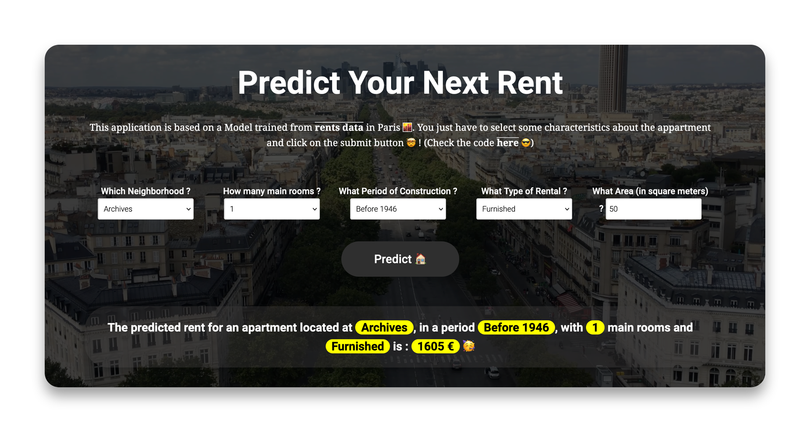

# Parisian Rents 
> A Machine Learning project from EDA to a Web Application

The idea of this application is to allow anyone that want to get an apartment inside Paris, to have **an estimation of the rent** he could have. 

The **model** behind has been trained on [**Open Source Parisian Data**](https://data.smartidf.services/explore/dataset/logement-encadrement-des-loyers/information/?disjunctive.id_zone&disjunctive.nom_quartier&disjunctive.piece&disjunctive.epoque&disjunctive.meuble_txt&sort=ref&disjunctive.annee&location=12,48.87126,2.34678&basemap=448ad0) about fixed rent by square meters for around 7000 apartments.

After an [**Exploratory Data Analysis**](https://github.com/npogeant/parisian_rents/blob/0081488a7b421edcbc724138c96cb4f1f8f8aabf/notebooks/EDA.ipynb) that you can find here, I processed **feature engineering** and **modeling** to find the best model ([this notebook](https://github.com/npogeant/parisian_rents/blob/master/notebooks/Modeling.ipynb)). I decided to have a baseline with a simple Linear Regression. The best model against this baseline was an [**XGBoost**](https://xgboost.readthedocs.io/en/stable/) one. I used [**HyperOpt**](https://hyperopt.github.io/hyperopt/) to process a hyperparameter optimization.

## The Web App

I wanted to have a simple web app that was allowing to ask the necessary features variable to the model and return an output as the rent. 
The model was trained on rent by square meters, thus, I needed to ask the Area of the apartment to return a rent for the entire apartment (area feature).

This is an example of the [**web application**](https://parisianrents.herokuapp.com/) : 

  

